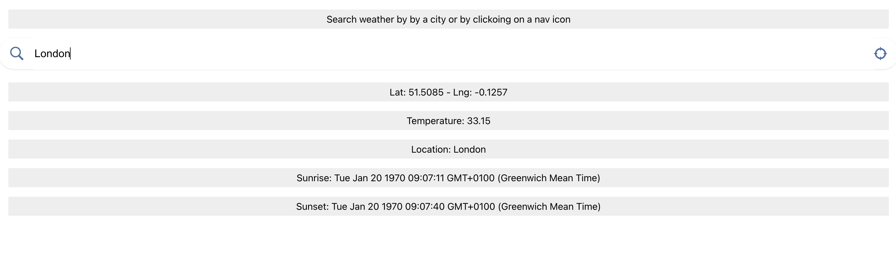
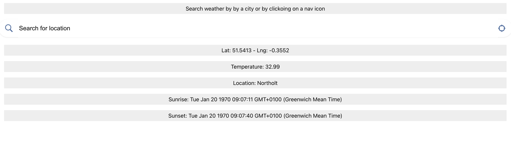

# React Weather




## Tech Stack

**React, Typescript, StyledComponents**

## Features

- **Weather info for the ity or location**

## Getting Started

Search a weather by typing in the input field or by clickin on the geo icon

```bash
git clone https://github.com/vghulyan/react-weather.git
```

```bash
cd react-weather
npm install
npm start
```
